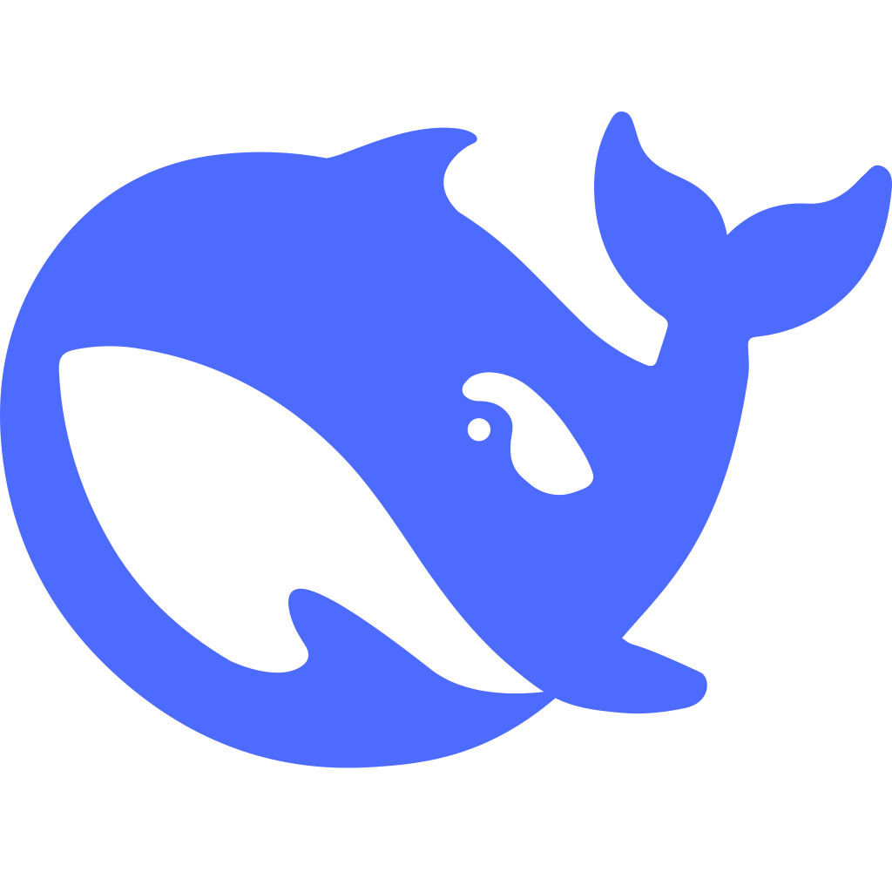

<div align="center">
  

  # 蓝色大肥鱼档案馆

  **鲸鱼娘 DeepSeek 同人表情包展示站**

  <a href="https://github.com/EDMOK/blue-fish-archive">GitHub</a>
  ·
  <a href="#版权与来源">版权与来源</a>
  ·
  <a href="#网站作者">网站作者</a>
</div>

<br />

<div align="center">
  
</div>

## 项目简介

围绕鲸鱼娘 DeepSeek 的同人表情包收集与展示项目。

页面采用卡通贴纸风格，提供自然瀑布流浏览、大图预览、复制图片和下载原图功能。

## 功能

<table>
  <tr>
    <td width="33%" align="center">
      <strong>表情墙</strong><br />
      <sub>自然瀑布流展示同人表情包</sub>
    </td>
    <td width="33%" align="center">
      <strong>原图操作</strong><br />
      <sub>复制图片或下载原始文件</sub>
    </td>
    <td width="33%" align="center">
      <strong>动图支持</strong><br />
      <sub>支持 GIF、WebP 和 APNG</sub>
    </td>
  </tr>
</table>

原始文件不加水印、不改格式、不降低分辨率。

## 内容管理

表情包文件统一存放在 [`media/`](media/) 目录中。

支持格式：

```text
PNG · JPG · JPEG · GIF · WebP · APNG
```

向 GitHub 仓库上传或删除图片后，GitHub Actions 会自动为 `media/` 里的图片生成 WebP 缩略图（`previews/`，页面瀑布流展示用）并更新 `stickers/manifest.json`。连接 Vercel 或 Cloudflare Pages 后，内容会随仓库更新自动重新部署；下载和复制仍保留 `media/` 下的原始文件，不降质。

```text
修改「media/」目录
        ↓
生成 WebP 缩略图 + 同步 manifest.json
        ↓
自动部署
```

## 版权与来源

### 鲸鱼娘角色形象原作

**上善无形** · [Bilibili](https://space.bilibili.com/4456176)

### DeepSeek 元素女仆鲸鱼娘二次设计

**ZipZipPipe** · [Bilibili](https://space.bilibili.com/4168597)

二次设计作品依 **CC BY-NC-SA 4.0** 授权：非商业使用，二创遵循相同协议。

本站为非官方同人整理项目，不代表任何官方立场。立绘及表情包的相关权利归原作者和各自创作者所有。如有版权或展示问题，请联系网站作者处理。

## 网站作者

**EDMOK**

[Bilibili](https://space.bilibili.com/291892724) · [GitHub](https://github.com/EDMOK)
