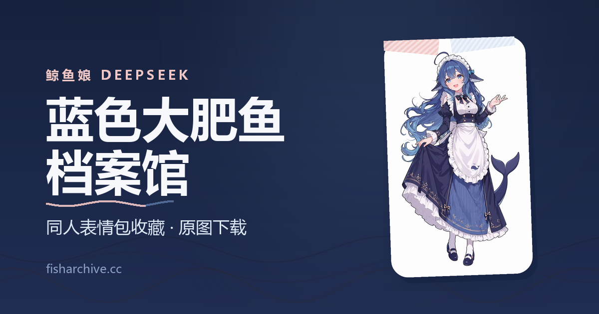
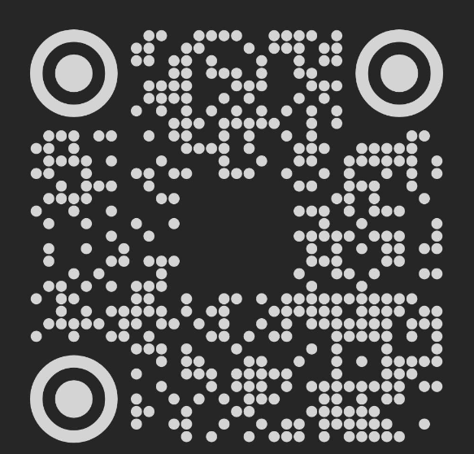

  

  # 蓝色大肥鱼档案馆

  **鲸鱼娘 DeepSeek 非官方同人表情包收藏站**

  原图不加水印、不改格式、不降低分辨率

  **295** 张表情 · **32** 个标签 · **8** 位角色 · **16** 张立绘

  <a href="https://fisharchive.cc/"><strong>访问网站</strong></a> · <a href="https://fisharchive.cc/gallery">全部表情</a> · <a href="https://fisharchive.cc/characters">角色立绘</a> · <a href="https://fisharchive.cc/manual">肥鱼万事屋</a> · <a href="https://fisharchive.cc/about#api">开放数据</a> · <a href="./CHANGELOG.md">更新日志</a>

 

围绕鲸鱼娘 DeepSeek 的同人表情收集与展示项目。表情墙按标签整理社区作品；角色图鉴收录 8 位 AI 拟人角色的立绘参考；肥鱼万事屋记录Deepseek相关折腾经验或心得。

## 这里有什么

<table>
  <tr>
    <td width="33%" align="center" valign="top">
      <strong>表情墙</strong>  
      瀑布流逛 295 张同人表情，按动图/静图和 32 个标签筛选，也可以「随机翻一张」碰碰运气。
    </td>
    <td width="33%" align="center" valign="top">
      <strong>原图收藏</strong>  
      预览里左右翻页，一键复制图片或下载原图。不加水印、不改格式、不降分辨率。
    </td>
    <td width="33%" align="center" valign="top">
      <strong>动图支持</strong>  
      GIF、WebP、APNG 在预览里直接播放，下载后动画与帧数完整保留。
    </td>
  </tr>
  <tr>
    <td width="33%" align="center" valign="top">
      <strong>角色图鉴</strong>  
      DeepSeek、ChatGPT、Claude、Gemini、GLM、Grok、Kimi、Qwen，全身与 Q 版立绘都有，高清大图供二创参考。
    </td>
    <td width="33%" align="center" valign="top">
      <strong>肥鱼万事屋</strong>  
      免费分享 DSH 养鱼教程：QQ 机器人搭建、语音唱歌、排错表和检查清单。
    </td>
    <td width="33%" align="center" valign="top">
      <strong>开放数据</strong>  
      完整表情清单公开，网页、脚本和机器人可以直接读取，无需申请密钥。
    </td>
  </tr>
</table>

## 随便翻几张

<table>
  <tr>
    <td align="center" valign="top">
       
      举手报到
    </td>
    <td align="center" valign="top">
       
      拿捏了
    </td>
    <td align="center" valign="top">
       
      比心
    </td>
  </tr>
  <tr>
    <td align="center" valign="top">
       
      已思考 13 秒
    </td>
    <td align="center" valign="top">
       
      破防大哭
    </td>
    <td align="center" valign="top">
       
      压力一只大肥鱼？
    </td>
  </tr>
</table>

 

  更多表情在 <a href="https://fisharchive.cc/">表情墙</a>，点开任意一张就能复制或下载原图。

## 收录与投稿

支持的格式：PNG、JPG、JPEG、GIF、WebP、APNG。

欢迎投稿表情包，以下三种方式任选其一：

- **QQ 群**：加入群 **1041665197**，直接把图片发在群相册。
- **提交 Issue**：在 [GitHub Issues](https://github.com/EDMOK/blue-fish-archive/issues) 附上图片或来源链接。
- **提交 Pull Request**：把原图放进 [`media/`](https://github.com/EDMOK/blue-fish-archive/tree/main/media)，按 CI 提示补齐清单后发起 PR。社区投稿可在 [`stickers/authors.json`](https://github.com/EDMOK/blue-fish-archive/blob/main/stickers/authors.json) 登记署名。

## 加入 QQ 群

群号：**1041665197**

扫码加入：

点击二维码查看大图。也可以在 [GitHub 仓库](https://github.com/EDMOK/blue-fish-archive) 查看源码，或通过 [Issues](https://github.com/EDMOK/blue-fish-archive/issues) 反馈问题。

## 版权与来源

### 鲸鱼娘角色形象原作

**上善无形** · [Bilibili](https://space.bilibili.com/4456176)

### DeepSeek 元素女仆鲸鱼娘二次设计

**ZipZipPipe** · [Bilibili](https://space.bilibili.com/4168597)

二次设计作品依 **CC BY-NC-SA 4.0** 授权：非商业使用，二创遵循相同协议。

本站为非官方同人整理项目，不代表任何官方立场。立绘及表情包的相关权利归原作者和各自创作者所有。如有版权或展示问题，请联系网站作者处理。

## 网站作者

**EDMOK**

[Bilibili](https://space.bilibili.com/291892724) · [GitHub](https://github.com/EDMOK)
